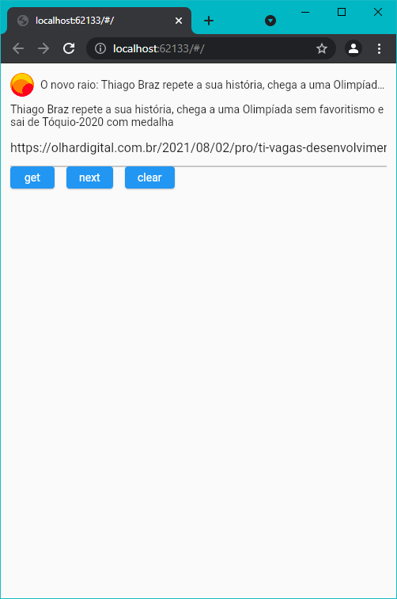

# link_preview_builder

Este é um plugin de visualização de URL que visualiza o conteúdo de um URL

Idioma: [Inglês](README.md) | [Português](README-PT.md)



## Característica especial

- Trabalho em plataformas cruzadas, incluindo web
- Receba apenas dados sem usar o widget
- Construtores de estado modificáveis: onEmpty, onError, onLoading e build
- Use multiprocessamento para analisar páginas da web, evite bloquear o processo principal
- Suporte para armazenamento em cache de conteúdo e mecanismos de expiração para retornar resultados mais rapidamente
- Melhor tolerância a falhas, várias maneiras de encontrar ícones, títulos, descrições, imagem
- Melhor suporte ao código gbk, sem código confuso
- Otimizado para arquivos grandes com melhor desempenho de rastreamento
- Suporte para autenticação de segundo salto com cookies
- Suporta GIF, vídeo e outra captura de conteúdo

## Começando

Você pode obter alguns dados ou usar o widget

## Obter dados de visualização

```dart
final GetLinkPreview _getLinkPreview = GetLinkPreview();
final result = await _getLinkPreview.call(_url);
```

## Widget de uso simples com url

```dart
LinkPreviewBuilder(
  url: 'https://www.youtube.com/watch?v=cYV4Ysw0Iuc'
)
```

## Widget de uso simples com InfoData após receber do GetLinkPreview

```dart
LinkPreviewBuilder(
  info: InfoData(),
)
```

## Widgets de mudança de estado

```dart
LinkPreviewBuilder(
  url: controller.value.text,
  onEmpty: const Text('empty state'),
  onError: (error) => Text(error ?? 'error'),
  onLoading: const CircularProgressIndicator(),
  builder: (info) => Text((info as WebInfo).title!));
```

## Renderização personalizada com construtor

```dart
Widget _buildCustomLinkPreview(BuildContext context) {
  return LinkPreviewBuilder(
    url: _controller.value.text,
    builder: (info) {
      if (info == null) return const SizedBox();
      if (info is WebImageInfo) {
        return CachedNetworkImage(
          imageUrl: info.image,
          fit: BoxFit.contain,
        );
      }

      final WebInfo webInfo = info;
      if (!WebAnalyzer.isNotEmpty(webInfo.title)) return const SizedBox();
      return Container(
        decoration: BoxDecoration(
          borderRadius: BorderRadius.circular(10),
          color: const Color(0xFFF0F1F2),
        ),
        padding: const EdgeInsets.all(10),
        child: Column(
          crossAxisAlignment: CrossAxisAlignment.start,
          children: <Widget>[
            Row(
              children: <Widget>[
                CachedNetworkImage(
                  imageUrl: webInfo.icon ?? "",
                  imageBuilder: (context, imageProvider) {
                    return Image(
                      image: imageProvider,
                      fit: BoxFit.contain,
                      width: 30,
                      height: 30,
                      errorBuilder: (context, error, stackTrace) {
                        return const Icon(Icons.link);
                      },
                    );
                  },
                ),
                const SizedBox(width: 8),
                Expanded(
                  child: Text(
                    webInfo.title,
                    overflow: TextOverflow.ellipsis,
                  ),
                ),
              ],
            ),
            if (WebAnalyzer.isNotEmpty(webInfo.description)) ...[
              const SizedBox(height: 8),
              Text(
                webInfo.description,
                maxLines: 5,
                overflow: TextOverflow.ellipsis,
              ),
            ],
            if (WebAnalyzer.isNotEmpty(webInfo.image)) ...[
              const SizedBox(height: 8),
              CachedNetworkImage(
                imageUrl: webInfo.image,
                fit: BoxFit.contain,
              ),
            ]
          ],
        ),
      );
    },
  );
}
```

## Código de amostra

[Clique aqui para obter um exemplo detalhado](exemplo/lib/main.dart). 