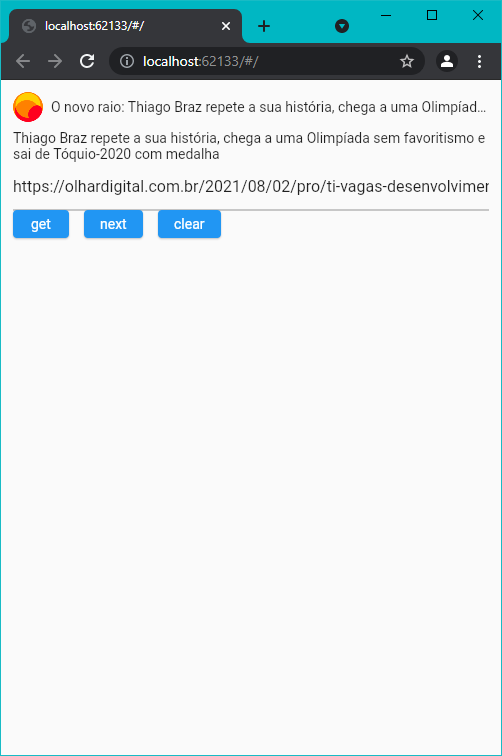

# link_preview_builder

This is a URL preview plugin that previews the content of a URL

Language: [English](README.md) | [Português](README-PT.md)



## Special feature

- Working on cross-platforms, including web
- Receive only data without using the widget
- Modifiable state constructors: onEmpty, onError, onLoading and build
- Use multiprocessing to analyze web pages, avoid blocking the main process
- Support for content caching and expiration mechanisms to return results faster
- Better fault tolerance, multiple ways to find icons, titles, descriptions, image
- Better gbk code support, no confusing code
- Optimized for large files with better tracking performance
- Support for second-hop authentication with cookies
- Supports GIF, video and other content capture 

## Getting Started

You can get some the data or use de widget

## Get Preview Data

```dart
final GetLinkPreview _getLinkPreview = GetLinkPreview();
final result = await _getLinkPreview.call(_url);
```

## Simple use widget with url

```dart
LinkPreviewBuilder(
  url: 'https://www.youtube.com/watch?v=cYV4Ysw0Iuc'
)
```

## Simple use widget with InfoData after received of GetLinkPreview

```dart
LinkPreviewBuilder(
  info: InfoData(),
)
```

## Change state widgets

```dart
LinkPreviewBuilder(
  url: controller.value.text,
  onEmpty: const Text('empty state'),
  onError: (error) => Text(error ?? 'error'),
  onLoading: const CircularProgressIndicator(),
  builder: (info) => Text((info as WebInfo).title!));
```

## Custom Rendering with builder 

```dart
Widget _buildCustomLinkPreview(BuildContext context) {
  return LinkPreviewBuilder(
    url: _controller.value.text,
    builder: (info) {
      if (info == null) return const SizedBox();
      if (info is WebImageInfo) {
        return CachedNetworkImage(
          imageUrl: info.image,
          fit: BoxFit.contain,
        );
      }

      final WebInfo webInfo = info;
      if (!WebAnalyzer.isNotEmpty(webInfo.title)) return const SizedBox();
      return Container(
        decoration: BoxDecoration(
          borderRadius: BorderRadius.circular(10),
          color: const Color(0xFFF0F1F2),
        ),
        padding: const EdgeInsets.all(10),
        child: Column(
          crossAxisAlignment: CrossAxisAlignment.start,
          children: <Widget>[
            Row(
              children: <Widget>[
                CachedNetworkImage(
                  imageUrl: webInfo.icon ?? "",
                  imageBuilder: (context, imageProvider) {
                    return Image(
                      image: imageProvider,
                      fit: BoxFit.contain,
                      width: 30,
                      height: 30,
                      errorBuilder: (context, error, stackTrace) {
                        return const Icon(Icons.link);
                      },
                    );
                  },
                ),
                const SizedBox(width: 8),
                Expanded(
                  child: Text(
                    webInfo.title,
                    overflow: TextOverflow.ellipsis,
                  ),
                ),
              ],
            ),
            if (WebAnalyzer.isNotEmpty(webInfo.description)) ...[
              const SizedBox(height: 8),
              Text(
                webInfo.description,
                maxLines: 5,
                overflow: TextOverflow.ellipsis,
              ),
            ],
            if (WebAnalyzer.isNotEmpty(webInfo.image)) ...[
              const SizedBox(height: 8),
              CachedNetworkImage(
                imageUrl: webInfo.image,
                fit: BoxFit.contain,
              ),
            ]
          ],
        ),
      );
    },
  );
}
```

## Sample code

[Click here for a detailed example](example/lib/main.dart).
